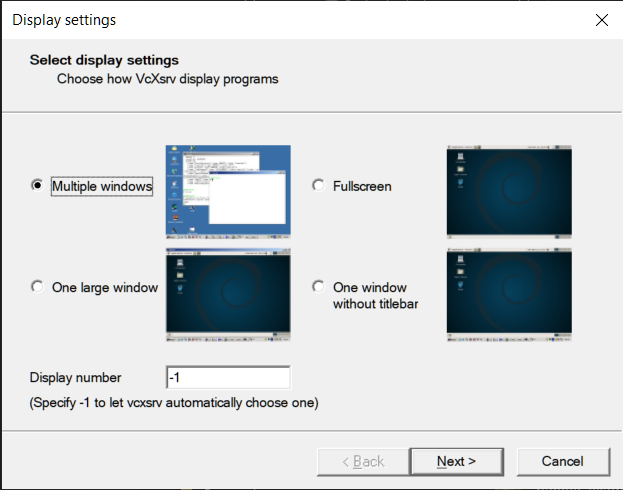
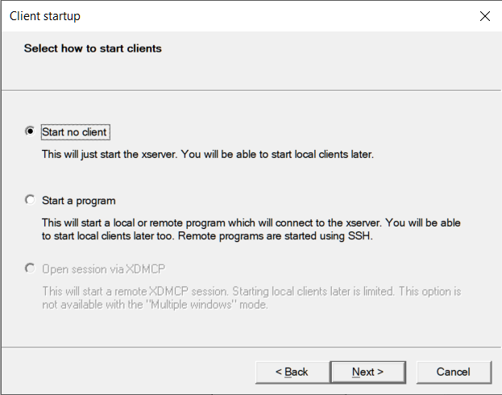
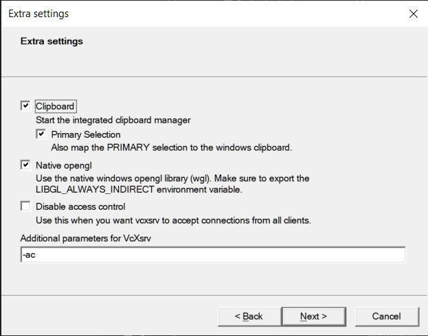
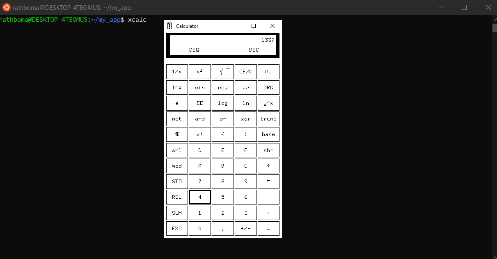
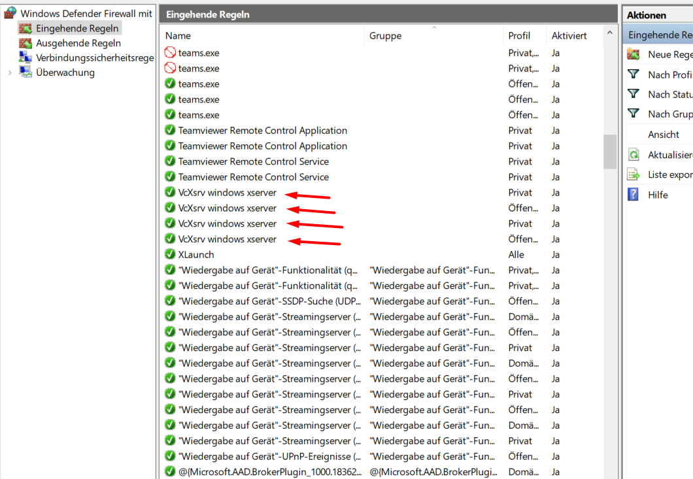
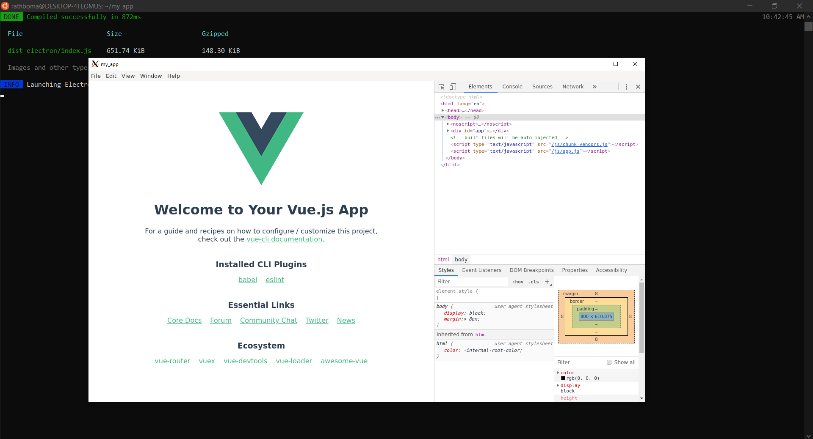

**Basic Development Tools**

This is easy, we’re in Ubuntu! Lets just install a bunch of things we know we’ll need.
```css
sudo apt update # this takes a while the first time
sudo apt install nodejs git npm # ~200mb of packages
sudo npm install -g yarn # Yarn is so much faster
```
**Setting up Electron**

Then lets make a quick Electron project. I think the easiest way to make an Electron app is with Vue.js, the Vue CLI, and the Vue Cli Electron Builder plugin. Let’s go.

```css
# system libraries needed for electron
sudo apt install libnss3-dev libgdk-pixbuf2.0-dev libgtk-3-dev libxss-dev
# install vue cli
sudo yarn global add @vue/cli

# create a project.
# follow instructions here https://cli.vuejs.org/guide/creating-a-project.html#vue-create
vue create --default my_app
cd my_app
vue add electron-builder
# install dependencies
yarn install

# That's it!! We have a fully working electorn app. Lets run it:

yarn run electron:serve

# NOTHING HAPPENS!? Where's the app window?
# There's no way for Ubuntu or Windows to display it!
```
**Viewing Linux Apps in Windows**

Out of the box, WSL 2 does not have a window manager in which to display linux apps, so we’ll have to install one, and configure WSL 2 to use it.

Hopefully in future this will be supported out-of-the box, until then, we’ll have to install our own.

What we need is called an X Server. Searching online for ‘WSL X server’ will yield a bunch of conflicting advice about which one to use. Just skip all that and install VcsXsrv. Yes I know that is a SourceForge link, just do yourself a favor and install it using Chocolatey.

There are also guides about running a whole Linux desktop environment. Running a full desktop environment is totally overkill and not at all nessecery for our purposes.

To configure VcsXsrv you’ll need two things:

An VcsXsrv config
An environment variable inside Ubuntu to tell it where to find the X Server
**VcsXsrv Config**

Open VcsXsrv and it’ll guide you through three config screens. Here’s what to pick on each one:

Choose Multiple Windows
Choose ‘Start no client’
Choose Clipboard and OpenGL integration, plus provide -ac as additional arguments





Save your config in your home directory for eash launching, then start the server. You’ll see the little X logo in your system tray. We’re ready to go.

**WSL Config**

```css
# Add the following lines to your ~/.bashrc file:

export DISPLAY=$(cat /etc/resolv.conf | grep nameserver | awk '{print $2}'):0
export LIBGL_ALWAYS_INDIRECT=true
```
To test that you have everything working, you can try starting an app. Lets try the basic x11 apps to make sure everything is working.

```css
sudo apt install x11-apps

xcalc
```
You should see the gorgeous x11 calc window.



Hey, that actually looks pretty good! Who needs the new Windows calculator anyway.

Oh wait, do you have a Hi-DPI screen and everything looks blurry? Ok you should follow this Stackoverflow post to stop the blur, or alternatively use X410 instead of vcsXsrv which supports hiDPI screens out of the box (but is a paid app). I simply disabled all dpi-scaling for vcsXsrv windows as I only have a 1080 screen.

**Running Our Electron App**

On Display installation make sure to chnage the Firewalls Settings regarding vcsrv otherwise no connection between wsl and your xlaunch Display Software will be established.

After you enabled every Firewall rule as following a Display Connection should be possible



Now we can run our electron dev server again.
```css
yarn run electron:serve
```
You’ll see a bunch of build messages, and if you’re lucky, you should now see your Electron app in all it’s glory



Great! Now when you make changes to your app it will auto-reload.

You can use yarn run electron:build command to create linux binaries.

**Adding Bootstrap**

For Better Design you may use some additional Frame such as Bootstrap-Vue.
```css
# With npm
npm install vue bootstrap bootstrap-vue

# With yarn
yarn add vue bootstrap bootstrap-vue
```
Then, register BootstrapVue in your app entry point (typically app.js or main.js):
```css
import Vue from 'vue'
import { BootstrapVue, IconsPlugin } from 'bootstrap-vue'

// Import Bootstrap an BootstrapVue CSS files (order is important)
import 'bootstrap/dist/css/bootstrap.css'
import 'bootstrap-vue/dist/bootstrap-vue.css'

// Make BootstrapVue available throughout your project
Vue.use(BootstrapVue)
// Optionally install the BootstrapVue icon components plugin
Vue.use(IconsPlugin)
```

[Source](https://www.beekeeperstudio.io/blog/building-electron-windows-ubuntu-wsl2)